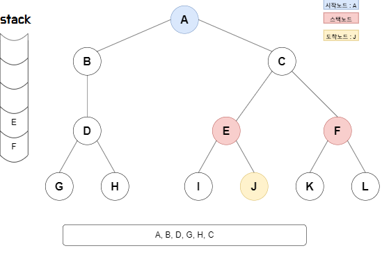
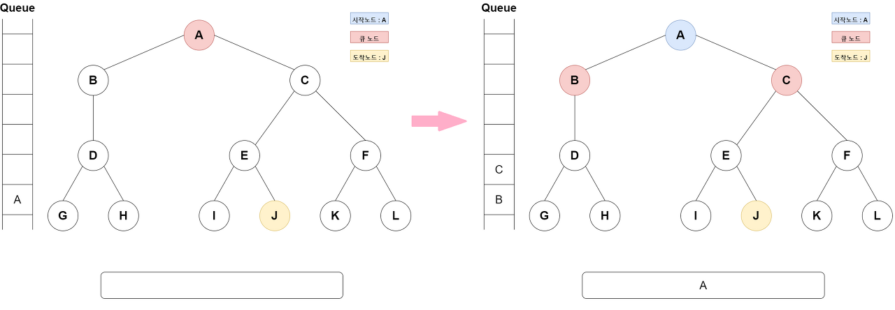
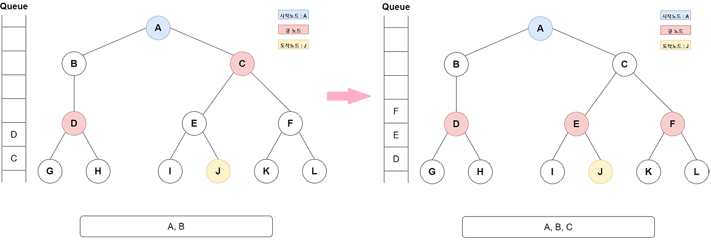
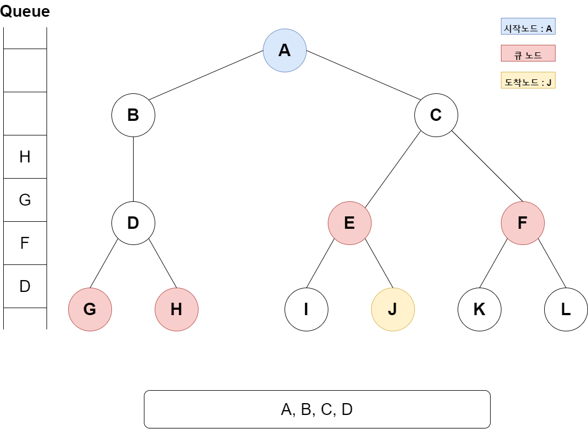

# Brute-Force Search : 완전 탐색 기법
* 스터디 일시 : 24.05.23 (목)
* 작성자 : 류태웅
> 사실 브루트포스 알고리즘과 완전 탐색 기법은 차이가 거의 없기에 브루트포스와 함께 작성한다.
다만, 아주 작은 차이가 있는데, 브루트포스 알고리즘은 **문제를 해결하기 위해 모든 경우를 탐색하고 답을 도출하는 알고리즘**이며,
완전 탐색 알고리즘은 **모든 경우의 수를 전부 탐색하는 방식의 알고리즘**을 칭하며 **그 결과를 찾는 것보단 탐색하는 과정에 중점**을 둔다.
([출처](https://olrlobt.tistory.com/33))

* 사용 조건
  1. 사용된 알고리즘이 적절한가? ( 문제를 해결할 수 있는가 )
  2. 효율적으로 동작하는가?


# 브루트포스 알고리즘
* 직역하면, 무식한 힘을 갖는 알고리즘이란 뜻으로, 완전 탐색 알고리즘의 한 종류이지만 완전 탐색의 또 다른 이름으로 쓰이기도 한다.

## 단순 브루트포스
* 설명
: 반복문이나 재귀를 사용하여, 모든 경우를 찾아 답을 도출해낸다.
  * 비밀번호를 뚫기 위해 모든 경우의 문자열을 입력하는 것과 같다.

### 코드
  * 문제 : [프로그래머스 : 최소 직사각형](https://school.programmers.co.kr/learn/courses/30/lessons/86491)
    * 가로 길이와 세로 길이 여러 개가 주어졌을 때, 여러 개중 최대의 크기를 구하는 문제.
    * 즉, 가장 간단한 경우 여러 모든 경우를 구하는 것.
    * 여기서는 반복문으로 모든 가로/세로 길이의 최대를 구해서 답을 구한다.
  * JAVA
  ```java
  class Solution {
    public int solution(int[][] sizes) {
        int max1 = 0;
        int max2 = 0;
        for(int i=0; i<sizes.length; i++){
            int[] now = sizes[i];
            max1 = Math.max(max1, Math.max(now[0], now[1]));
            max2 = Math.max(max2, Math.min(now[0], now[1]));
        }
        return max1*max2;
    }
  }
  ```
  * JavaScript
  ```javascript
  function solution(sizes) {
    let max1 = 0;
    let max2 = 0;

    for (let i = 0; i < sizes.length; i++) {
        let [width, height] = sizes[i];
        max1 = Math.max(max1, Math.max(width, height));
        max2 = Math.max(max2, Math.min(width, height));
    }

    return max1 * max2;
  }
  ```

### 실제 사용 예시
* 암호학에서의 브루트포스 : 무차별 암호대입 공격
: 만약 현재 독자의 비밀번호가 "12"로 2글자라고 하자. 이러면 2글자의 모든 문자열의 경우의 수는 100여가지가 된다. 그렇기에 반복문을 이용한 문자열 생성 프로그램 사용 시 자동으로 뚫리게 된다. 이러한 이유로 **현재 웹사이트의 비밀번호는 8자 이상으로 제한**되어 8자 이상일 때 모든 경우의 수를 구하면 상당한 시간이 걸리며, **12자 이상일 시 소프트웨어를 통해 구하면 수년의 시간이 걸리게 된다.**

  * 크리덴셜 재활용
  : 이전에 확보한 사용자 이름과 비밀번호를 이용하는 공격 방법.
  사용자 이름과 비밀번호는 다른 무차별 암호 대입 공격, 데이터 유출, 다크 웹 등의 경로로 확보 후 이 정보는 다른 서비스에 침투하는 데 사용된다.
  예를 들어 해커가 여러분의 Facebook 로그인 정보를 탈취하고, 탈취한 정보로 은행 계좌에도 접근했다면 크리덴셜 재활용 공격이 발생한 것으로 볼 수 있고, 이를 방지하기 위해서는 **다양한 계정에서 동일한 비밀번호를 사용하지 않는 것이 좋다.**

  * 사전 공격
  : 보통 사람들은 "Monkey" 등 사전에 있는 단어로 비밀번호를 작성하는 경우가 많다. 그렇기에 사전에 있는 단어들로 무차별 암호대입 공격을 수행한다. 또한, 사전의 단어뿐만 아니라 "123456" 등 **사람들이 자주 사용하는 비밀번호를 이용해 공격이 진행**되기도 한다.

  * 역방향 무차별 암호 대입 공격
  무차별 암호 대입 공격을 역방향으로 시도하는 방식.
  하나의 계정에 여러 비밀번호를 입력하는 무차별 암호 대입 공격과 달리, 역방향 무차별 암호 대입 공격은 **하나의 비밀번호를 여러 계정에 입력**한다.이러한 공격 방식은 무작위 계정 대신 특정인의 계정을 탈취할 때 자주 사용되는 방식이다.

## 비트마스크
* 설명
: 저장 객체를 따로 두지 않고, 이진수로 이를 표시하여 기록하는 것으로, 알고리즘은 아니지만 완전 탐색 알고리즘에서 많이 사용하는 테크닉이다.
예를 들어 어떠한 노드들의 방문 여부가 필요하지만 메모리가 부족하고 오버헤드의 감소가 강요되는 경우, boolean 배열이 아닌 000000 이런 식으로 두어, 1번 도시를 방문했다면 000001 이런 식으로 마스킹을 수행한다.
* 문제 : [백준 2098 : 외판원 순회](https://www.acmicpc.net/problem/2098)
  * [자세한 풀이 방법](https://velog.io/@rtunu12/G1-2098-%EC%99%B8%ED%8C%90%EC%9B%90-%EC%88%9C%ED%9A%8C)
  * 코드를 보면 따로 방문 요소를 boolean 배열로 하는 것이 아닌, 이진수를 두어 방문하지 않은 곳은 0, 방문한 곳은 1로 처리한다.

# 완전 탐색 기법
: 여기서의 완전 탐색은 그래프 대신 배열을 사용하는 문제를 통하여 설명한다.

## DFS : 깊이 우선 탐색

* 설명
: **스택**이나 **재귀함수**을 사용하여 루트 노드(혹은 다른 임의의 노드)에서 시작해서 다음 분기로 넘어가기 전에 해당 분기를 완벽하게 탐색하는 방식으로, 쉽게 설명해서 먼저 쭉 파고든 뒤에 다른 곳으로 이동한다고 생각하면 쉬울 것이다.
  * 왜 스택을 사용하는가?
  : 스택은 LIFO 성질을 가진다. 그렇기에 더 이상 방문할 정점이 없으면 이전 상태로 돌아갈 수 있다.
    * 큐로는 구현이 불가능하다. 애초에 FIFO이기에 이전 상태로 되돌아가지 못하고 바로 방문 후 output한다. (그렇기에 큐는 BFS에서 사용된다.)
    * 재귀는 가능하다. 애초에 재귀 자체가 함수 호출 스택이다.
    * 덱으로는 가능하다. 덱은 큐와 스택의 성질을 합친 것이기에 이 덱으로 DFS와 BFS 둘다 구현이 가능하다.
      * 왜 쓰질 않는가?
        * 구현의 직관성
        : 간단하다. 애초에 스택이나 재귀로 하는 것이 편리하다.
        즉 위의 방식이 DFS의 원리에 직접적으로 부합하며 구현도 간단하다.
        * 불필요한 유연성
        : 덱은 양쪽에서 output이 가능하여 FIFO와 LIFO 기능을 둘다 할 수 있다.
        하지만 이렇게 될 경우 절반의 기능은 사용을 하지 않는다.
        즉 덱의 추가적인 기능은 DFS를 구현하는데 필요하지 않고, 오히려 코드가 더 복잡해진다.
      * 하지만 장점도 존재한다.
      바로 위에서 얘기한 유연성으로, 덱을 사용한 인터페이스로 BFS와 DFS 둘다 코드의 변경 없이 구현만으로 둘다 사용이 가능하다.


1. 목표가 J라고 할 때, 루트 노드 또는 시작 지점 A부터 스택에 담는다.
2. 스택에 담긴 A를 꺼내면서 A와 연결된 노드 B와 C를 스택에 담는다.


3. 스택에 담긴 노드 B와 C 중 먼저 담긴 B부터 깊이 탐색을 시작한다.


4. B의 연결된 노드로 계속해서 이동하다가 끝 지점(이미 방문한 노드 제외 연결된 노드가 없는 경우) G와 H의 방문이 끝났다면 스택에서 빼준다.
5. 다음 노드 C부터 깊이 탐색을 시작한다.
 

6. C와 연결된 노드 탐색 중 목적지인 J를 발견하면 탐색이 끝난다.

* 시간복잡도
  * 인접 행렬에서의 시간 복잡도: O(V²)
  * 인접 리스트에서의 시간 복잡도: O(V+E)
    * V: 정점(노드)의 개수, E: 간선의 개수

* 장점
  * 현재 경로상의 노드들만 기억하면 되므로 저장공간이 비교적 적게 든다.
  * 깊이 우선 탐색(DFS)이 너비 우선 탐색(BFS)보다 좀 더 간단함 (DFS와  BFS를 둘 다 사용해도 되는 문제)
    * ex : 그래프의 모든 정점을 방문하는 문제
  * 목표노드가 깊은 단계에 있을 경우 해를 빨리 구할 수 있다.

* 단점:
  * 해가 없는 경로에 깊이 빠질 가능성이 있다.
    * 따라서 실제의 경우 미리 지정한 임의의 깊이까지만 탐색하고 목표노드를 발견하지 못하면 다음의 경로를 따라 탐색하는 방법이 유용할 수 있다
  * 얻어진 해가 최단 경로가 된다는 보장이 없다.
    * 목표에 이르는 경로가 다수인 문제에 대해 깊이우선 탐색은 해에 다다르면 탐색을 끝내버리므로, 이때 얻어진 해는 최적이 아닐 수 있다는 의미이다.

* 적합한 문제
  * 경로의 특징을 저장해둬야 하는 문제 (경로 상의 노드를 기억해야하는 문제)
    * 예를 들면 각 정점에 숫자가 적혀있고 a부터 b까지 가는 경로를 구하는데 경로에 같은 숫자가 있으면 안 된다는 문제 등, 각각의 경로마다 특징을 저장해둬야 할 때는 DFS를 사용한다.
  * 검색 대상 그래프 큰 문제
    * 목표노드가 깊은 단계에 있을 경우 해를 빨리 구할 수 있기 때문이다.
* 코드
  * 문제 : [백준 22251 : 빌런 호석](https://www.acmicpc.net/problem/22251)
    * [자세한 풀이 방법](https://velog.io/@rtunu12/22251-G5-%EB%B9%8C%EB%9F%B0-%ED%98%B8%EC%84%9D)
    * 그래프 문제도 아닌데 DFS를 쓰는 이유
    : 예시를 들어 설명해보자, [][][][][] 총 다섯 칸을 가진 배열이 존재하고 한 칸에 들어갈 수 있는 경우가 여러가지 있다고 가정해보자.
    DFS 함수의 파라미터는 현재 값, 현재 깊이로 이루어지며 이때 **깊이는 현재 칸의 인덱스, 즉 어디까지 했는가를 표시하는 값이다.** 즉, 0번째 인덱스에서 여러가지 경우의 수를 재귀를 통해 깊이+1 후 다시 재귀를 하는 방식으로 이루어진다.
    * 재귀와 스택의 관련
    : DFS(int now, int depth)로 정의하고 DFS(0, 0)으로 시작해보자.
    DFS 안에선 여러 경우의 수*DFS(next, depth+1)로 다시 재귀를 한다.
    만일 위처럼 5칸의 배열에서 이를 수행할 경우 경우의 수의 가장 끝까지, 배열의 마지막 칸까지 수행한 수 다시 다른 경우의 수의 첫번째부터 다시 실행하게 된다.
    이는 재귀 자체가 스택을 통하여 실행되는 것으로 볼 수 있기에, 재귀와 스택은 서로 관련이 있다고 보면 된다.
    
  * JAVA
  : DFS 함수가 DFS를 구현한 것이다. 잘 보면 재귀를 통하여 다음 깊이로 넘어가는 것을 볼 수 있다.
  ```java
  // https://www.acmicpc.net/problem/22251

  import java.io.*;
  import java.util.*;

  public class Main{
    static String[] ledTurn = {
        "1110111", // 0
        "0010010", // 1
        "1011101", // 2
        "1011011", // 3
        "0111010", // 4
        "1101011", // 5
        "1101111", // 6
        "1010010", // 7
        "1111111", // 8
        "1111011"  // 9
    };
    static int n, k, p;
    static String x;
    static int cnt = 0;
    public static void main(String[] args) throws IOException{
        BufferedReader br = new BufferedReader(new InputStreamReader(System.in));
        StringTokenizer st = new StringTokenizer(br.readLine());
        n = Integer.parseInt(st.nextToken());
        k = Integer.parseInt(st.nextToken());
        p = Integer.parseInt(st.nextToken());
        x = st.nextToken();
        StringBuilder sb = new StringBuilder();
        for(int i=0; i<k-x.length(); i++){
            sb.append("0");
        }
        sb.append(x);
        x = sb.toString();
        dfs(0, sb.toString(), p);
        System.out.println(cnt-1);
    }
    static void dfs(int level, String nowNum, int nowP){
        if(nowP==0 || level==k){
            if(Integer.parseInt(nowNum)>0 && Integer.parseInt(nowNum)<=n){
                //System.out.println(nowNum+" "+(nowP));
                cnt++;
            }
            return;
        }
        StringBuilder sb = new StringBuilder(nowNum);
        int target = x.charAt(level) - '0';
        for(int i=0; i<ledTurn.length; i++){
            int minusP = Math.abs(diff(ledTurn[target], ledTurn[i]));
            //System.out.println(target+" "+i+" "+minusP);
            sb.setCharAt(level, (char)(i+'0'));
            if(nowP-minusP<0){
                sb.setCharAt(level, (char)(target+'0'));
                continue;
            }
            dfs(level+1, sb.toString(), nowP-minusP);
        }
    }
    static int diff(String binary1, String binary2){
        StringBuilder xorResult = new StringBuilder();
        for(int i=0; i < binary1.length(); i++){
            if(binary1.charAt(i) != binary2.charAt(i)) xorResult.append('1');
            else xorResult.append('0');
        }
        int cnt = 0;
        for(int i=0; i<xorResult.length(); i++){
            if(xorResult.charAt(i) == '1') cnt++;
        }
        return cnt;
    }
  }
  ```
  * JS
  : 마찬가지로 재귀를 통해 내부 스택으로 DFS를 수행한다.
  ```javascript
  const ledTurn = [
    "1110111", // 0
    "0010010", // 1
    "1011101", // 2
    "1011011", // 3
    "0111010", // 4
    "1101011", // 5
    "1101111", // 6
    "1010010", // 7
    "1111111", // 8
    "1111011"  // 9
  ];

  let n, k, p;
  let x;
  let cnt = 0;

  function main() {
    const input = require('fs').readFileSync('/dev/stdin', 'utf8').trim().split('\n');
    const [firstLine, xValue] = input;
    const [nValue, kValue, pValue] = firstLine.split(' ').map(Number);
    n = nValue;
    k = kValue;
    p = pValue;
    x = xValue;

    let sb = '';
    for (let i = 0; i < k - x.length; i++) {
        sb += '0';
    }
    sb += x;
    x = sb;

    dfs(0, sb, p);
    console.log(cnt - 1);
  }

  function dfs(level, nowNum, nowP) {
    if (nowP === 0 || level === k) {
        if (parseInt(nowNum, 10) > 0 && parseInt(nowNum, 10) <= n) {
            cnt++;
        }
        return;
    }

    let sb = nowNum.split('');
    const target = parseInt(x.charAt(level), 10);
    for (let i = 0; i < ledTurn.length; i++) {
        const minusP = Math.abs(diff(ledTurn[target], ledTurn[i]));
        sb[level] = i.toString();
        if (nowP - minusP < 0) {
            sb[level] = target.toString();
            continue;
        }
        dfs(level + 1, sb.join(''), nowP - minusP);
    }
  }

  function diff(binary1, binary2) {
    let cnt = 0;
    for (let i = 0; i < binary1.length; i++) {
        if (binary1.charAt(i) !== binary2.charAt(i)) cnt++;
    }
    return cnt;
  }

  main();
  ```
## BFS : 너비 우선 탐색

* 설명
: **큐**를 사용하여 루트 노드(혹은 다른 임의의 노드)에서 시작해서 인접한 노드를 먼저 탐색한다.
그렇게 되면 시작 정점으로부터 가까운 정점을 먼저 방문하고 멀리 떨어져 있는 정점을 나중에 방문할 수 있다.


1. 시작 지점 A를 큐에 넣는다. 
2. A를 큐에서 빼면서 A와 맟닿은 노드 B와 C를 큐에 넣는다.


3. B를 큐에서 빼면서 B와 맟닿은 노드(방문한 노드 제외) G와 H를 큐에 넣는다.
4. C를 큐에서 빼면서 C와 맟닿은 노드(방문한 노드 제외) E와 F를 큐에 넣는다.
  

5. E를 큐에서 빼면서 E와 맟당은 노드(방문한 노드 제외)를 찾을 때 목적지 J가 있으므로 목적지에 도달할 수 있다.

* 시간복잡도  
  * 시간복잡도는 DFS와 똑같다. 모든 정점을 한 번씩 방문하여 인접한 간선을 검사하기 때문이다.
  * 인접 행렬에서의 시간 복잡도: O(V²)
  * 인접 리스트에서의 시간 복잡도: O(V+E)
    * V: 정점(노드)의 개수, E: 간선의 개수

* 장점
  * 출발노드에서 목표노드까지의 최단 길이 경로를 보장한다.
* 단점:
  * 경로가 매우 길 경우에는 탐색 가지가 급격히 증가함에 따라 보다 많은 기억 공간을 필요로 하게 된다.
  * 해가 존재하지 않는다면 유한 그래프(finite graph)의 경우에는 모든 그래프를 탐색한 후에 실패로 끝난다.
  * 무한 그래프(infinite graph)의 경우에는 결코 해를 찾지도 못하고, 끝내지도 못한다.
* 적합한 문제
  * 최단거리 탐색 문제
    * 너비 우선 탐색으로 현재 노드에서 가까운 곳부터 찾기 때문에 경로를 탐색 시 먼저 찾아지는 해답이 곧 최단거리기 때문이다.(장점)
  * 검색대상의 규모가 크지 않고, 검색 시작 지점으로부터 원하는 대상이 별로 멀지 않다면 BFS
* 코드
  * 문제 : [프로그래머스 : 아이템 줍기](https://school.programmers.co.kr/learn/courses/30/lessons/87694)
    * [자세한 풀이 방법](https://velog.io/@rtunu12/lv.3-%EC%95%84%EC%9D%B4%ED%85%9C-%EC%A4%8D%EA%B8%B0)
    * 그래프 문제도 아닌데 BFS를 쓰는 이유
    BFS일 경우 모든 경우에서 첫번째를 먼저 탐색한 뒤 그 뒤를 탐색하는 방법이다. 즉 이 로직은 n차원 배열 형태에서 여러 방향으로 이동할 때 유효하다.
    * 자세히 설명해서 dx, dy로 이루어져 상하좌우로 1칸씩 이동할 수 있다는 제약이 존재할 때, 현재 now에서 상, 하, 좌, 우의 경우로 큐에 담은 뒤 큐에서 하나씩 빼면서 다음 칸에서의 방향을 결정하는 방법으로 풀이할 수 있다.
  * JAVA
  bfs함수가 BFS를 구현한 것이다. 잘 보면 큐를 이용하여 너비 우선으로 탐색하는 것을 볼 수 있다.
  ```java
  import java.util.*;

  class Solution {
    static int[] dx = {1, 0, -1, 0};
    static int[] dy = {0, 1, 0, -1};
    static int[][] map = new int[102][102];
    static boolean[][] check = new boolean[102][102];
    public int solution(int[][] rectangle, int cx, int cy, int ix, int iy) {
        int answer = 0;
        for(int i=0; i<rectangle.length; i++){
            int[] now = rectangle[i];
            for(int j=0; j<now.length; j++){
                now[j] *= 2;
            }
            makeLine(now);
        }
        answer = bfs(cx*2, cy*2, ix*2, iy*2);
        return answer;
    }
    public void makeLine(int[] xy){
        for(int i=xy[0]; i<=xy[2]; i++){
            for(int j=xy[1]; j<=xy[3]; j++){
                if((i==xy[0] || i==xy[2] || j==xy[1] || j==xy[3]) && (map[i][j]!=2)) map[i][j]=1;
                else map[i][j]=2;
            }
        }
    }
    public int bfs(int cx, int cy, int ix, int iy){
        Queue<int[]> queue = new LinkedList<>();
        queue.add(new int[]{cx, cy, 0});
        check[cx][cy] = true;
        while(!queue.isEmpty()){
            int[] now = queue.poll();
            if(now[0]==ix && now[1]==iy) return now[2]/2;
            for(int i=0; i<4; i++){
                int nx = now[0]+dx[i];
                int ny = now[1]+dy[i];
                if(nx<0 || ny<0 || nx>=102 || ny>=102) continue;
                if(map[nx][ny]!=1 || check[nx][ny]) continue;
                queue.add(new int[]{nx, ny, now[2]+1});
                check[nx][ny] = true;
            }
        }
        return 0;
    }
  }
  ```
  * JavaScript
  ```JavaScript
  const dx = [1, 0, -1, 0];
  const dy = [0, 1, 0, -1];
  const map = Array.from({ length: 102 }, () => Array(102).fill(0));
  const check = Array.from({ length: 102 }, () => Array(102).fill(false));

  function solution(rectangle, cx, cy, ix, iy) {
    let answer = 0;

    for (let i = 0; i < rectangle.length; i++) {
      const now = rectangle[i].map(val => val * 2);
      makeLine(now);
    }

    answer = bfs(cx * 2, cy * 2, ix * 2, iy * 2);
    return answer;
  }

  function makeLine(xy) {
    for (let i = xy[0]; i <= xy[2]; i++) {
      for (let j = xy[1]; j <= xy[3]; j++) {
        if ((i === xy[0] || i === xy[2] || j === xy[1] || j === xy[3]) && (map[i][j] !== 2)) {
        map[i][j] = 1;
        } else {
          map[i][j] = 2;
        }
      }
    }
  }

  function bfs(cx, cy, ix, iy) {
    const queue = [[cx, cy, 0]];
    check[cx][cy] = true;

    while (queue.length > 0) {
      const [x, y, distance] = queue.shift();

      if (x === ix && y === iy) {
        return distance / 2;
      }

      for (let i = 0; i < 4; i++) {
        const nx = x + dx[i];
        const ny = y + dy[i];

        if (nx < 0 || ny < 0 || nx >= 102 || ny >= 102) continue;
        if (map[nx][ny] !== 1 || check[nx][ny]) continue;

        queue.push([nx, ny, distance + 1]);
        check[nx][ny] = true;
      }
    }

    return 0;
  }
  ```
## DFS vs BFS
| 특성 | DFS (Depth-First Search) | BFS (Breadth-First Search) |
|---|---|---|
| **탐색 방법** | 깊이 우선 탐색. 한 경로를 끝까지 탐색한 후 다른 경로를 탐색 | 너비 우선 탐색. 인접한 모든 노드를 탐색한 후 다음 레벨로 이동 |
| **사용 자료구조** | 스택 (재귀 호출을 통해 내부적으로 스택을 사용) | 큐 |
| **경로** | 한 경로를 끝까지 탐색 | 현재 노드의 모든 인접 노드를 탐색 |
| **메모리 사용량** | 현재 경로상의 노드들만 저장하면 되므로 상대적으로 적음 | 모든 노드를 저장해야 하므로 상대적으로 많음 |
| **시간 복잡도 (인접 행렬)** | O(V²) | O(V²) |
| **시간 복잡도 (인접 리스트)** | O(V + E) | O(V + E) |
| **경로 최적화** | 최단 경로를 보장하지 않음 | 최단 경로를 보장 |
| **적합한 문제** | 경로의 특징을 저장해야 하는 문제, 목표 노드가 깊은 단계에 있을 경우 | 최단 거리 탐색 문제, 목표 노드가 시작 지점에서 멀지 않은 경우 |
| **장점** | 저장 공간이 적게 든다, 구현이 간단하다 | 최단 경로를 보장한다 |
| **단점** | 해가 없는 경로에 빠질 가능성이 있다, 최단 경로 보장 안됨 | 경로가 길 경우 기억 공간을 많이 사용, 무한 그래프에서는 해를 찾지 못할 수도 있음 |

## Reference
- [브루트포스](https://olrlobt.tistory.com/33)
- [무차별 암호대입 공격](https://nordvpn.com/ko/blog/brute-force-attacks/)
- [비트마스크](https://mygumi.tistory.com/361)
- [완전 탐색](https://hongjw1938.tistory.com/78)
- [BFS, DFS](https://cobi-98.tistory.com/36?category=1109491)
- [문제에 대한 풀이, 내 블로그](https://velog.io/@rtunu12/posts)
