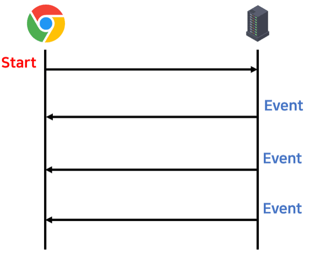
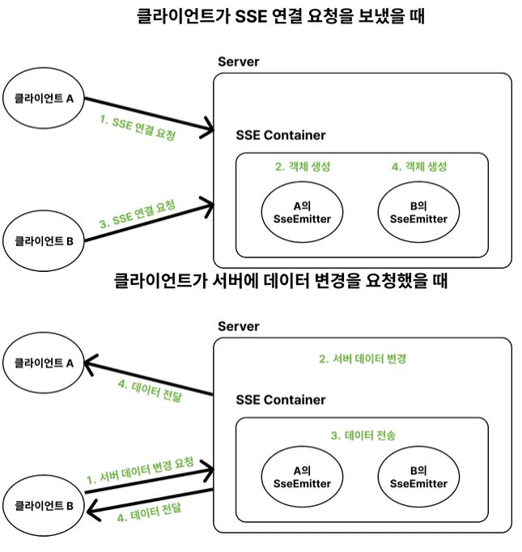
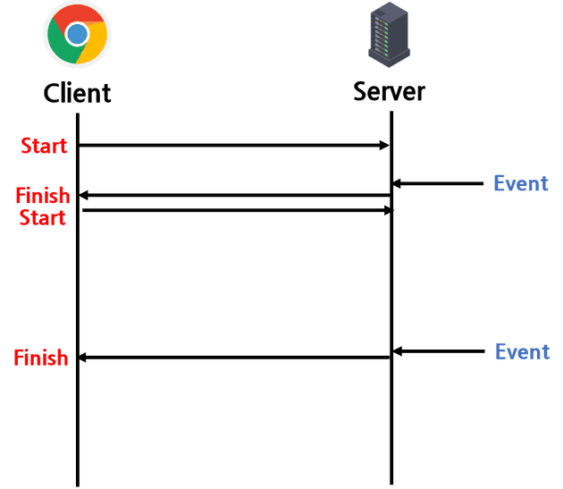
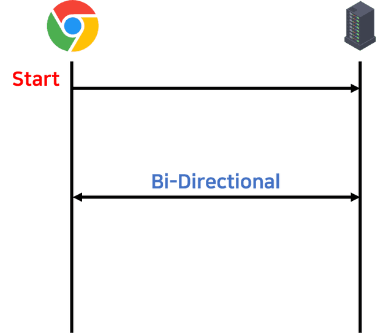

# SSE

## SEE란?



> - 출처 : https://amaran-th.github.io/Spring/[Spring]%20Server-Sent%20Events(SSE)/

- 정의

  - : 클라이언트가 서버와 최초로 연결하고 난 후 서버가 클라이언트에게 이벤트가 발생할 때마다 데이터를 전송하는 단방향 통신 방식

- 과정

  - **(1) Client : SSE Subscribe 요청**
  - **(2) Server : Subscription에 대한 응답**
  - **(3) Server : 이벤트 생성 및 전송**

- 특징

  - 단방향 통신
    - : SSE는 서버에서 클라이언트로만 데이터를 전송
    - : 즉, 클라이언트에서 서버로 데이터를 보내기 위해서는 별도의 AJAX 요청이 필요
  - 텍스트 기반 메시징
    - : 데이터는 주로 UTF-8 형식의 텍스트로 전송
      - (JSON 형식을 포함하여 텍스트를 통해 표현할 수 있는 모든 데이터 형식을 전송할 수 있음을 의미)
  - 자동 재연결
    - SSE 연결이 끊어졌을 경우, 클라이언트는 자동으로 서버에 재연결을 시도
      - (개발자가 재연결 시간 간격을 설정할 수도 있음)
  - 간단한 구현
    - HTTP 프로토콜만으로 사용할 수 있어 구현이 용이

- 예제 코드
  - 전체 로직
  
  > - 출처 : https://amaran-th.github.io/Spring/[Spring]%20Server-Sent%20Events(SSE)/
  - Server (Spring)

    ```java
    // SseEmitter 객체를 반환하는 REST 컨트롤러를 구현.
    // SseEmitter를 사용하여 10번의 이벤트를 클라이언트에 전송하고,
    // 각 이벤트 사이에 1초의 딜레이를 두어 현재 시간을 전송
    // 오류가 발생하거나 작업이 완료되면 연결을 종료
    import org.springframework.web.bind.annotation.GetMapping;
    import org.springframework.web.bind.annotation.RestController;
    import org.springframework.web.servlet.mvc.method.annotation.SseEmitter;
    import java.io.IOException;
    import java.util.Date;
    import java.util.concurrent.ExecutorService;
    import java.util.concurrent.Executors;

    @RestController
    public class SseController {

    private final ExecutorService executor = Executors.newSingleThreadExecutor();

    @GetMapping("/stream-sse")
    public SseEmitter streamSse() {
        SseEmitter emitter = new SseEmitter();

        executor.execute(() -> {
            try {
                for (int i = 0; i < 10; i++) {
                    // 클라이언트에게 데이터를 전송
                    emitter.send(new Date().toString());
                    // 1초 대기
                    Thread.sleep(1000);
                }
                emitter.complete();
            } catch (IOException | InterruptedException e) {
                emitter.completeWithError(e);
            }
        });
        return emitter;
        }
    }
    ```

  - Client (React)
    ```JavaScript
    // /stream-sse 경로에서 SSE 연결을 생성하고,
    // 서버로부터 메시지를 받아 messages 상태 배열에 추가
    // 또한, 컴포넌트가 언마운트될 때 SSE 연결을 정리하는 클린업 함수를 제공
    import React, { useEffect, useState } from "react";

    function Client() {
        const [messages, setMessages] = useState([]);

        useEffect(() => {
            const eventSource = new EventSource("http://localhost:8080/stream-sse");

            eventSource.onmessage = function (event) {
                console.log("New message:", event.data);
                // 메시지 목록에 새 메시지 추가
                setMessages((prevMessages) => [...prevMessages, event.data]);
            };

            eventSource.onerror = function (event) {
                console.error("EventSource failed:", event);
                eventSource.close();
            };

            // 컴포넌트 언마운트 시 연결 종료
            return () => eventSource.close();
        }, []);

        return (
            <div>
                <h1>Received Messages</h1>
                <div>
                    {messages.map((msg, index) => (
                    <div key={index}>{msg}</div>
                    ))}
                </div>
            </div>
        );
    }
    export default Client;
    ```

## 다른 통신 방식과의 차이점
- Polling
  - 클라이언트가 주기적으로 서버에 요청을 보내는 방식
  
  - 장점
    - 단순한 구현
  - 단점
    - 리소스 낭비 : 계속 요청을 해야 함
  - 사용
    - 요청하는 데 부담이 적고, 요청 주기를 넉넉하게 잡아도 될 정도로 실시간성이 중요하지 않고, 데이터 갱신이 특정한 주기를 갖는 서비스에 적합
- Long Polling
  - Polling에 비해 유지 시간을 조금 더 길게 가지며, 요청을 보내고 서버에서 변경이 일어날때까지 대기한다.
  
  - 장점
    - Connection이 연결된 동안 이벤트 발생을 실시간으로 감지할 수 있음
    - 지속적으로 요청을 보내지 않으므로 부담이 덜하다.
  - 단점
    - 유지 시간을 짧게 설정한다면 Polling과 차이가 없음
    - 지속적으로 연결되어 있기 때문에 다수의 클라이언트에게 동시에 이벤트가 발생할 경우 순간적 부담이 급증
  - 사용
    - 실시간 전달이 중요한데 상태가 빈번하게 갱신되진 않을 때 적합
- WebSocket
  
  - 양방향 통신, 최초 접속은 HTTP 요청을 통한 handshakiing으로 이루어짐.
  - 장점
    - HTTP와 달리 지속적으로 Connection을 지속하기 때문에 연결에 드는 불필요한 비용을 제거할 수 있음
    - 용량이 큰 HTTP 헤더를 최초 접속 시에만 보내기 때문에 리소스를 절약 가능
    - 웹 소켓 포트에 접속해있는 모든 클라이언트에 이벤트 방식으로 응답 가능
  - 단점
    - 복잡한 구현: SSE에 비해 구현이 더 복잡하며, 서버도 웹소켓 프로토콜을 지원해야 함
    - 추가적인 서버 자원 사용: 연결 유지에 더 많은 자원을 사용

## 논의점

## Reference

https://amaran-th.github.io/Spring/[Spring]%20Server-Sent%20Events(SSE)/
